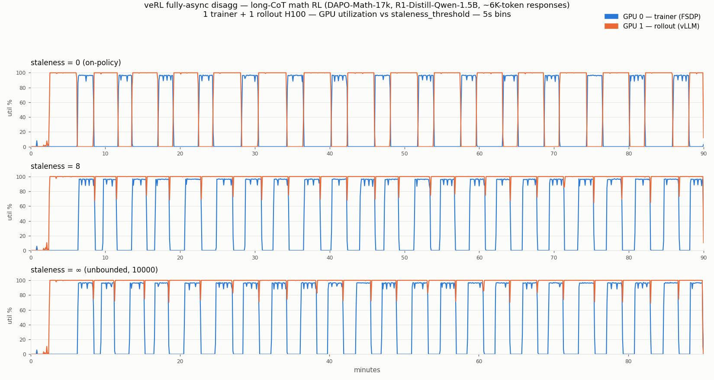
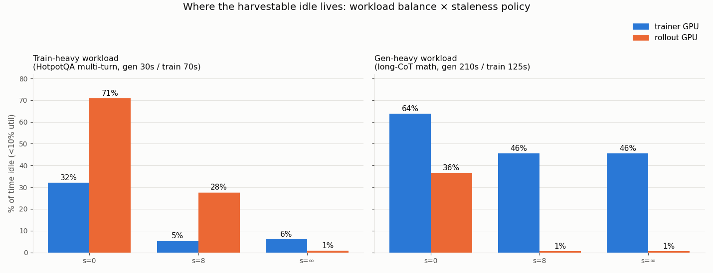

# Gen-Heavy Async RL — Long-CoT Staleness Sweep (Phase 4)

**Question:** on a realistic generation-dominant workload — with zero artificial slowing — does
veRL's fully-async disaggregated mode leave the **trainer** GPU idle, and can any staleness policy
fix it?

**Answer: the trainer starves at every staleness setting.** Staleness shrinks and reshapes the
idle; it cannot eliminate it, because generation is structurally slower than training and
pipelining can only hide the smaller of the two.

| Config | Step time | Trainer wait | Trainer GPU idle | Trainer idle blocks | Rollout GPU idle |
|---|---|---|---|---|---|
| **s=0 (on-policy)** | 340s | 214s | **63.8%** | 14 × **~197s** (max 231s) | 36.5% (~118s blocks) |
| s=8 | 223s | 83s | **45.5%** | 21 × **~96s** (max 126s) | 0.6% (99.2% util) |
| **s=∞ (unbounded)** | 224s | 89s | **45.5%** | 21 × ~96s (max 126s) | 0.6% (99.3% util) |

## Workload — the canonical "blogs" recipe, untuned

- **DeepSeek-R1-Distill-Qwen-1.5B** on **DAPO-Math-17k** (512 prompts, verl-format,
  in-tree `math_dapo` reward), single-turn long chain-of-thought
- max_response_length=8192, temp 1.0, rollout.n=8 — **measured response length ~6.0K tokens mean,
  max pinned at the cap**, in every run. The gen-heaviness comes purely from CoT length
  (autoregressive decode: ~200-220s per 64-sample batch; parallel fwd/bwd training: ~124s)
- veRL fully-async disagg, 1 trainer + 1 rollout H100, TP=1, sync_step=1, gen_batch_size=1,
  gpu_mem_util=0.8 — no throttling anywhere; only `staleness_threshold` varied
- Learning is real: score climbed −0.66 → −0.46 (±1 reward) at s=0
- Only documented deviation: `ppo_max_token_len_per_gpu=24576` + dynamic bsz (throughput packing
  for ~10K-token sequences). Zero crashes, zero redeploy iterations across all three runs.

## Why staleness can't save the trainer

The message queue **never buffered a single sample in any run** (`mq=0` at every step; staleness
counters frozen after the initial burst; `dropped_stale=0`). A staleness budget only matters if the
rollouter can get *ahead* — and a rollouter that needs ~210s per batch against a ~124s consumer
can never get ahead. s=8 and s=∞ are statistically identical because the budget never binds at
either value. Staleness overlaps generation with the update window (step 340s → 223s, a real
throughput win) and then saturates: the residual ~85-95s/step gap is the raw gen−train imbalance,
and it lands on the trainer as one contiguous idle block per step.

## The combined regime map (this sweep + the train-heavy sweep)

Same async mode, same hardware, same knobs — only the workload's gen:train ratio differs
([train-heavy sweep: ../async-multiturn/REPORT.md](../async-multiturn/REPORT.md)):

| | s=0 (on-policy) | bounded s≥1 | unbounded |
|---|---|---|---|
| **Train-heavy** (HotpotQA multi-turn, 30s:70s) | both idle, anti-phase (32% / 71%) | rollout GPU only (28-48%, ~30s blocks) | neither (~1%) |
| **Gen-heavy** (long-CoT math, 210s:125s) | both idle, anti-phase (64% / 36%) | **trainer GPU, 46%, ~96s blocks** | **trainer GPU, 46% — unchanged** |

The general law all eight cells obey: **the slower side pins its GPU; the faster side idles in
clean per-step blocks; staleness moves idle onto the faster side but can never push it below the
throughput imbalance.**

## Time-slicing implications

1. **Gen-heavy (reasoning) workloads keep the trainer GPU harvestable at every staleness policy**
   — 46-64% idle in 1.6-3.3-minute contiguous, perfectly periodic blocks. This is the strongest
   time-slicing target measured in this project, and it's the workload class (R1/DAPO-style
   long-CoT RL) the community actually runs.
2. On-policy (s=0) doubles the opportunity: both GPUs idle in anti-phase — ~50% of total capacity.
3. The blocks are large and predictable (one per step, duration ≈ |gen − train|), exactly the
   shape a time-slicing scheduler wants.
4. The alternative remedy — resizing pools (e.g., 2 rollout : 1 trainer to fit 210s gen inside
   125s train) — is static, while the gen:train ratio drifts within a run (CoT lengths grow as
   the model learns; contexts grow across turns). Time-slicing harvests the residual bubble
   wherever it currently is.

## Artifacts

`results/`: `run_{s0,s8,sinf}_{gpu_util.csv,train.log,experiment.log}`, `run_*_summary.json`,
`sweep_summary.{csv,json}`, `analyze_run.py`. Job spec: `k8s-job-async-longcot.yaml` +
`data_prep.py`. Charts: `plot_sweep.py`. verl commit 983cb0f2.

Prior phases: [../benchmark-longtail/REPORT.md](../benchmark-longtail/REPORT.md) (Phase 1),
[../benchmark-deepresearch/REPORT.md](../benchmark-deepresearch/REPORT.md) (Phase 2),
[../async-multiturn/REPORT.md](../async-multiturn/REPORT.md) (Phase 3).
