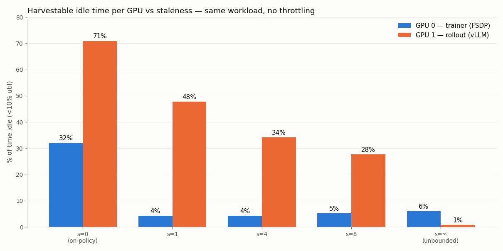
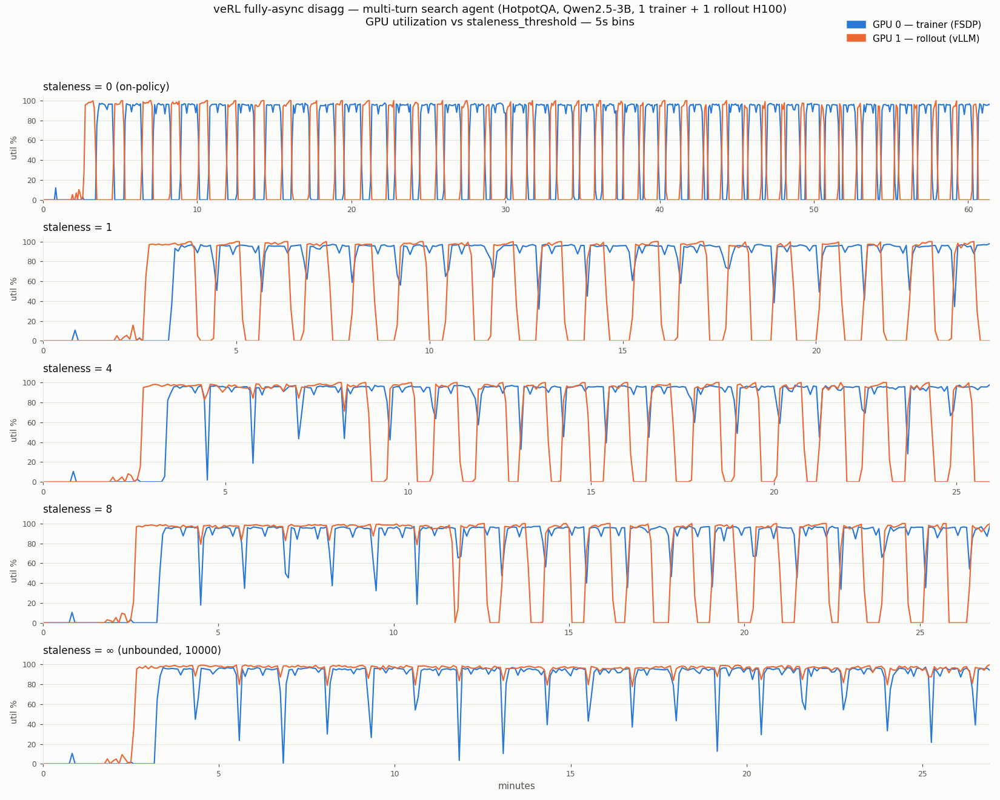

# veRL Fully-Async Disagg × Multi-Turn Agentic RL — Staleness Sweep (Phase 3)

**Question:** does a multi-turn tool-calling workload create harvestable GPU idle in veRL's own
fully-async disaggregated mode — with out-of-the-box configs, no artificial throttling — and how
does that idle move as the staleness budget grows?

**Answer:** yes for on-policy and bounded staleness; the *location* of the idle flips at s≥1.

| Mode | Trainer GPU idle | Rollout GPU idle | Time-slicing target |
|---|---|---|---|
| **s=0 (on-policy)** | **32%** — 38 blocks, ~27s each (max 43s) | **71%** — ~60s blocks (max 72s) | **both GPUs, anti-phase** |
| s=1 | 4% (only ~2.5s weight-sync gaps) | **48%** — ~32s blocks | rollout GPU |
| s=4 | 4% | **34%** — ~28s blocks | rollout GPU |
| s=8 | 5% | **28%** — ~27s blocks | rollout GPU |
| **s=∞ (unbounded)** | 6% | **0.8% — zero idle blocks** | **neither** |

## Setup

Identical across all 5 runs; **only `staleness_threshold` varied**:

- veRL main, `experimental/fully_async_policy` (async disagg), `trigger_parameter_sync_step=1`,
  `gen_batch_size=1`, `partial_rollout=True`, `gpu_memory_utilization=0.8` — defaults, no starvation knobs
- 1 trainer H100 (FSDP) + 1 rollout H100 (vLLM TP=1), Qwen2.5-3B-Instruct
- Workload: HotpotQA multi-hop QA (512 prompts, search-R1 format) with verl's native ToolAgentLoop
  (hermes) calling a **WikiSearchTool** → local pyserini BM25 Wikipedia server (~60-line user tool;
  verl main ships no in-tree SearchTool)
- Tool use was genuine in every run: **~5 turns/trajectory mean, up to 16**; EM reward climbed
  0.17→0.45 (it actually learns the task)
- 15-38 steady-state steps per config, 100ms GPU sampling; unbounded expressed as
  `staleness_threshold=10000` (verl has no ∞ sentinel)

## Mechanics per regime

**s=0 — mutual ping-pong.** The queue never buffers (`mq=0` every step). Each 88s step: rollouter
generates ~26s (trainer idle), trainer updates ~61s (rollouter barred from running ahead → idle),
0.8s weight sync. Both GPUs show one large, contiguous, perfectly periodic idle block per step.

**s=1-8 — trainer saturates, idle migrates.** One step of staleness lets generation (~30s) hide
entirely inside the training window (~70s): trainer collect-wait collapses 26.3s → 0.2s and the
trainer GPU pins at ~91%. All idle moves to the rollout GPU, which fills its staleness budget then
pauses — regular ~27-32s blocks. Deeper budgets only deepen the queue (max 256 → 512 samples);
**step time is flat at ~72s from s=1 to s=∞ — throughput is 100% trainer-bound, so staleness
beyond 1 buys zero speed and only costs data freshness.**

**s=∞ — divergent, nothing to harvest.** The rollouter never pauses (96% util, zero idle blocks
≥2s) and the queue grows without bound (576 samples and climbing at run end; samples arbitrarily
stale). Neither GPU is time-sliceable — but this regime over-generates data the trainer will
consume ever-more-stale, which is not a config anyone should run with sync_step=1.

## Why this workload starves the pipeline when GSM8K didn't

Phase 1 (same async mode, GSM8K + Qwen2.5-0.5B) stayed balanced at default configs — idle
appeared only with artificial throttling (`gpu_mem=0.25`, `require_batches=32`). The difference is
**batch generation latency**: GSM8K single-turn generation takes seconds; here each trajectory is
~5 sequential generate→search→generate rounds with growing contexts, and the batch waits for its
slowest (up to 16-turn) straggler — ~30s per batch. At s=0 that latency converts 1:1 into trainer
idle. The dataset alone does what the throttling knobs did.

## Implications for time-slicing

1. **On-policy async RL is doubly time-sliceable**: ~50% of the 2-GPU capacity idles in clean
   anti-phase blocks (27s trainer / 60s rollouter per step) — a scheduler could run a second
   workload on whichever GPU is off-phase.
2. **Bounded-staleness async remains time-sliceable on the rollout GPU only**: regular ~30s idle
   blocks, shrinking from 48% (s=1) to ~28% (s=8) of time.
3. **Unbounded staleness eliminates the opportunity** — and is also the regime nobody should want
   (unbounded queue growth, unbounded staleness, no throughput gain over s=1).
4. Block durations here (~27-60s) scale with workload size: bigger batches, longer contexts, more
   turns, or a larger model stretch generation time and with it every idle window (the colocated
   deep-research run — [../benchmark-deepresearch/REPORT.md](../benchmark-deepresearch/REPORT.md) —
   hit 150s+ gen phases at only 32 trajectories × 6 turns).

## Caveats

- Sweep points are 15-19 steady-state steps (~20-25 min each); s=0 has 37. Short but the pattern
  is strictly periodic in every run.
- At s=8 the queue was still deepening when the run ended — its rollout-idle number (28%) may read
  slightly low vs true steady state. The s=∞ run bounds the limit: ~0%.
- Rewards/learning are real but modest (EM 0.45 by step ~35 at lr 5e-7); irrelevant to the phase
  structure.

## Artifacts

`results/`: per-run traces + logs (`run_s0_final_*`, `run_s1_*`, `run_s4_*`, `run_s8_*`,
`run_sinf_*`), per-run `run_*_summary.json`, combined `sweep_summary.csv/.json`, `analyze_run.py`.
Job spec: `k8s-job-async-multiturn.yaml` (+ `wiki_search_tool.py`, `data_prep.py`, `NOTES.md`
scoping). Charts: `plot_sweep.py`.

Prior phases: [../benchmark-longtail/REPORT.md](../benchmark-longtail/REPORT.md) (Phase 1:
async + GSM8K needs artificial starvation), [../benchmark-deepresearch/REPORT.md](../benchmark-deepresearch/REPORT.md)
(Phase 2: multi-turn long-tail is natural, colocated).
