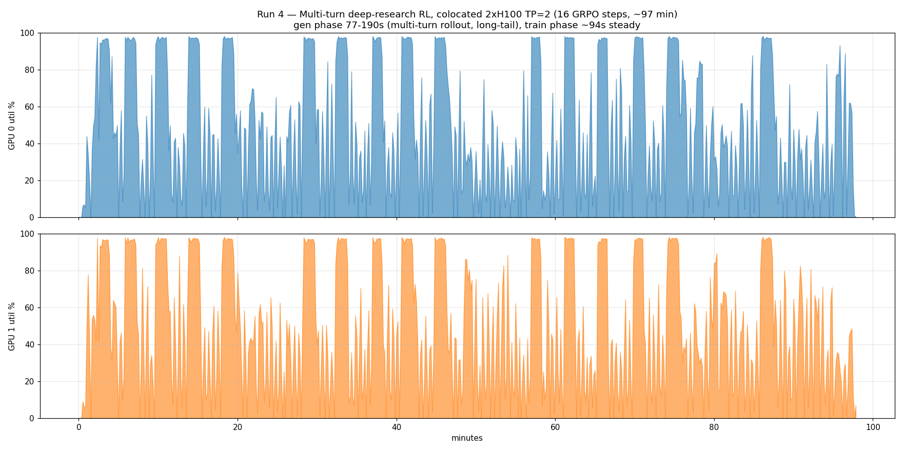
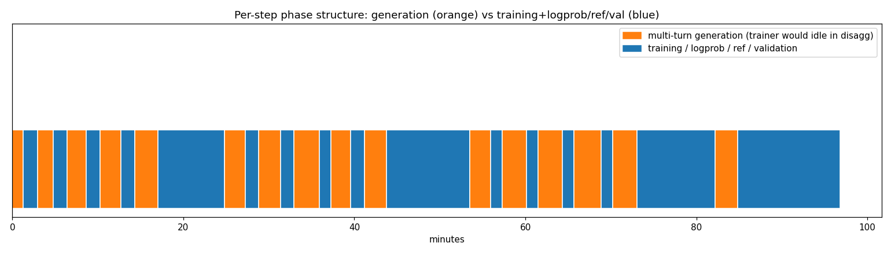

# Multi-Turn Deep-Research RL — Natural Long-Tail Benchmark (Phase 2)

Phase 1 (single-turn async disagg, artificial starvation) is documented in
[../benchmark-longtail/REPORT.md](../benchmark-longtail/REPORT.md). This phase demonstrates the
same trainer-starving generation phases arising **naturally** from a multi-turn agentic workload,
with zero throttling knobs.

## Workload

| Component | Value |
|---|---|
| Recipe | [cxcscmu/verl-agent-deepresearch](https://github.com/cxcscmu/verl-agent-deepresearch) (arXiv:2510.06534) |
| Model | Qwen2.5-3B-Instruct (Llama-3.2-3B is gated) |
| Dataset | MHQA (multi-hop QA, in-repo) |
| Rollout | Multi-turn agent loop: generate → parse action → search → append → generate, up to `env.max_steps=6` turns |
| Search backend | Local Wikipedia BM25 (pyserini `wikipedia-dpr-100w`, Serper-format HTTP shim on :8877) |
| Batch | 8 prompts × `group_n=4` = 32 trajectories/step, GRPO |
| Hardware | 2×H100 (a3-megagpu-8g spot), sync **colocated** hybrid engine, TP=2 |
| Config deltas vs CMU | Hardware adaptation only (model swap, batch 32→8, rollout.n 8→4, local search) — **no artificial throttling** |

## Results — Run 4 (16 GRPO steps, ~97 min, complete 100ms GPU trace)





| Metric | Value |
|---|---|
| Generation phase | **77s → 190s** (mean 150s), grows with context length across steps |
| Training phase | ~94s steady (update_actor ~60s + old_log_prob ~17s + ref ~17s) |
| Validation (steps 4/8/12/16) | ~290s extra |
| GPU 0 / GPU 1 mean util | 47.2% / 47.6% |
| GPU 0 / GPU 1 idle (≤15%) | **33.7% / 33.8%** |
| Generation share of wall time | 41% |

**Reproducibility:** three runs (1, 3, 4) all landed at ~34% idle, ~45-51% mean util.

### The natural long-tail

Per-turn completion counts from the rollout loop (typical step):

```
turn 4:  2/32 completed, 30 active
turn 5:  8/32 completed, 24 active
turn 6: 13/32 completed, 19 active   ← 19 trajectories run all 6 turns
```

Most trajectories never finish early — the batch is dominated by stragglers doing the full
search→read→generate loop with growing contexts. That is what stretches generation to 150s+ and
leaves the GPUs spiky/underutilized during it (visible in the timeline between the flat ~100%
training plateaus).

## Key findings

1. **The long-tail is intrinsic to the workload.** Generation dominates and grows (77→190s)
   with no tuning — unlike Phase 1, which needed `gpu_mem=0.25` + `require_batches=32` to force it.
2. **Colocated mode converts the long-tail into low utilization, not reclaimable idle.** The same
   GPUs alternate vLLM↔FSDP roles; the ~34% idle is straggler taper and engine transitions, not
   free GPU time another job could use.
3. **Disaggregated projection:** with gen and training on separate GPUs, the trainer GPU would sit
   fully idle for the entire generation phase — 2.5-3+ min per step on a single sampler GPU
   (colocated gen is 77-190s on TP=2; TP=1 roughly doubles it) — a natural square wave. This is
   the Phase 3 experiment: port of the multi-turn loop into the rl-time-slicing disagg sync
   trainer (see [../disagg-deepresearch/PLAN.md](../disagg-deepresearch/PLAN.md)).
4. Rewards read 0.000 by design — CMU's reward is a gpt-4o-mini judge behind a dummy API key.
   Irrelevant to GPU-phase behavior; a ~30-line local F1 scorer can replace it if learning curves
   are ever needed.

## Artifacts

| File | Contents |
|---|---|
| `gpu_util_run4_final.csv` | 100ms trace, 43,185 samples × 2 GPUs, md5-verified |
| `train_run4_final.log` / `experiment_run4_final.log` | Full 16-step training logs |
| `train_run3_final.log` | Run 3 log (same profile; raw CSV lost to spot scale-down) |
| `run4_gpu_timeline.png` / `run4_phase_structure.png` | Charts (`plot_run4.py`) |
| `k8s-job.yaml` + `Dockerfile` | Reproducible job (all runtime fixes in ConfigMap; trace gzip+base64 dumped to Cloud Logging at completion) |
