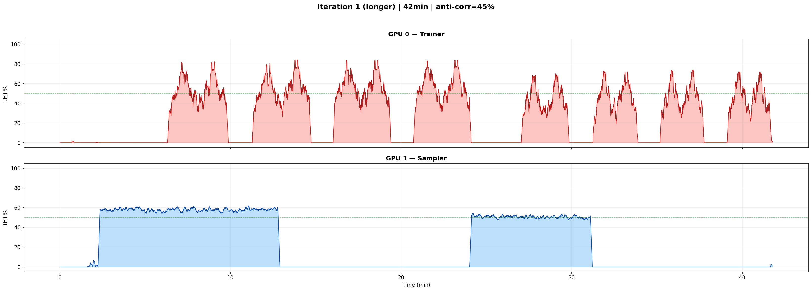
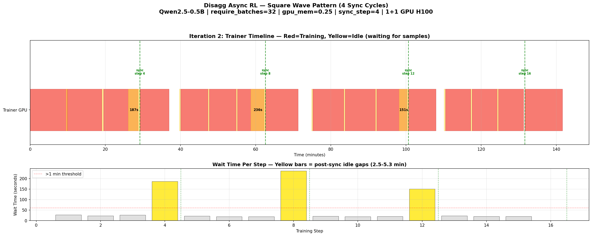

# Async Disagg RL — Square Wave Benchmark Report

## Goal

Reproduce the square wave GPU utilization pattern in veRL's async disaggregated mode to demonstrate time-slicing opportunity: trainer GPUs sit idle for minutes while waiting for the sampler to generate on-policy data after weight syncs.

## Working Recipe

**Config that produced 4 repeating sync cycles with 2.5-5.3 min idle gaps:**

| Parameter | Value | Why |
|---|---|---|
| `trainer.n_gpus_per_node` | 1 | Trainer faster than sampler on 1 GPU |
| `rollout.n_gpus_per_node` | 1 | Single sampler GPU = generation bottleneck |
| `model` | Qwen2.5-0.5B-Instruct | Small enough for 1 GPU, fast training |
| `async_training.require_batches` | 32 | 1024 samples per training step |
| `async_training.trigger_parameter_sync_step` | 4 | Weight sync every 4 training steps |
| `async_training.staleness_threshold` | 0 | On-policy: stale samples rejected after sync |
| `rollout.gpu_memory_utilization` | 0.25 | Throttles sampler concurrency |
| `actor.ppo_epochs` | 2 | More training compute per step |
| `actor.ppo_mini_batch_size` | 128 | Larger mini-batches for better GPU utilization |
| `rollout.n` | 16 | 16 samples per prompt |
| `total_rollout_steps` | 65536 | Enough to prevent premature termination |
| `data.max_response_length` | 4096 | |
| `data.gen_batch_size` | 1 | veRL async requires this |

**Hardware:** 1+1 H100 GPUs on `h100-2gpu-spot` node pool (GKE, us-west1-b)

**Job spec:** [disagg-sync-job-iter2.yaml](disagg-sync-job-iter2.yaml)

## Results — 4 Sync Cycles

16 training steps completed across 4 full weight sync cycles (~2.5 hours):

| Step | Wait Time | Queue Len | Phase |
|---|---|---|---|
| 1 | **319s (5.3 min)** | 0 | Initial warmup |
| 2 | 28s | 4062 | Queue full |
| 3 | 23s | 4096 | Queue full |
| 4 | 26s | 0 | **SYNC** |
| 5 | **187s (3.1 min)** | 0 | Post-sync idle |
| 6 | 22s | 6325 | Queue refilled |
| 7 | 19s | 4096 | Queue full |
| 8 | 19s | 0 | **SYNC** |
| 9 | **236s (3.9 min)** | 0 | Post-sync idle |
| 10 | 21s | 5002 | Queue refilled |
| 11 | 19s | 4096 | Queue full |
| 12 | 19s | 0 | **SYNC** |
| 13 | **151s (2.5 min)** | 0 | Post-sync idle |
| 14 | 22s | 8007 | Queue refilled |
| 15 | 20s | 4096 | Queue full |
| 16 | 20s | 0 | **SYNC** |

**Pattern per sync cycle:** ~30 min training (4 steps × ~8 min) → **2.5-3.9 min idle** → repeat

### GPU Utilization (Iteration 1 trace — same pattern, shorter run)

- Trainer (GPU 0): 33% busy, 58% idle — clear repeating humps with gaps
- Sampler (GPU 1): 32% busy, 58% idle — block-like generation phases
- Anti-correlation: 45%

### Square Wave Timeline (Iteration 2 — 4 sync cycles from logs)

Yellow bars show 2.5-5.3 minute idle gaps after each weight sync at steps 4, 8, 12, 16.

## Key Findings

1. **veRL async is a concurrent pipeline by design** — both pools run simultaneously to maximize utilization. Getting idle gaps requires deliberately imbalancing throughput.

2. **Trainer is faster than sampler** — confirmed with 1+1 GPU setup. Training processes batches in seconds; autoregressive generation is the bottleneck.

3. **Idle gaps appear at weight sync boundaries** — with `staleness=0`, stale data is flushed after sync. The trainer must wait for the sampler to regenerate fresh on-policy data. This creates 2.5-5.3 min idle gaps.

4. **Between syncs, both pools stay busy** — the queue buffers enough data for the trainer to process continuously. No idle between individual training steps (only ~20s collection time).

5. **The pattern is artificially created** — we throttled the sampler (`gpu_mem=0.25`) and used large batch accumulation (`require_batches=32`). With default configs, both pools are balanced and no idle gaps appear.

## Why This Is Hard to Reproduce

- veRL's async mode is designed to prevent idle gaps (concurrent pipeline)
- Getting idle gaps requires fighting the framework: throttling sampler, large batches, on-policy constraints
- Small config changes break the pattern (too fast → balanced pipeline, too slow → trainer never starts)
- The 0.5B model barely stresses H100s (low GPU utilization even during busy phases)

## Phase 2: Natural Long-Tail via Multi-Turn Agentic RL — DONE

The deep-research recipe (cxcscmu/verl-agent-deepresearch) produces the long-tail naturally:
multi-turn search→read→generate loops, variable turn counts, growing contexts. Reproduced with
zero artificial tuning — generation phases of 77-190s per step, ~34% idle across three runs.
Full results: [../benchmark-deepresearch/REPORT.md](../benchmark-deepresearch/REPORT.md).

Phase 3 (in progress): disaggregated port so the generation phase becomes true trainer-GPU idle —
plan in [../disagg-deepresearch/PLAN.md](../disagg-deepresearch/PLAN.md).
