# Async RL Time-Slicing — Worklog (incremental runs)

Chronological log of every incremental run and blocker on the way to the final
result. The reader-facing curated report is `RESULTS.md` — it contains only the
final 3-recipes × 4-modes matrix. This file preserves the full history:

1. **12-run 1-step survey** (June) — first pass at 3 recipes × 4 modes; every run
   silently died at its first weight sync (pidfd, diagnosed later), so each run
   captured only a single training step. Superseded by the multi-step matrix in
   RESULTS.md but kept here for the per-run overlays and the initial findings.
2. **pidfd_getfd root cause + fix** (2026-07-23) — the blocker that had killed
   every multi-step attempt.
3. **0.5B steady-state validation** — 64 steps / 63 weight syncs, proving the
   square wave is periodic, not a startup artifact.
4. **7B exact-recipe steady-state** (2026-07-25) — 10 steps / 9 syncs with the
   recipe's exact model+data (Qwen2.5-Math-7B + DAPO-Math-17k).
5. **Phase 1 at scale** (2026-07-26) — all 3 recipes × Mode 4 defaults,
   29-39 syncs each (this graduated into RESULTS.md).

---

## Objective

Determine whether GPU time-slicing (checkpoint/restore) applies to **async RL** workloads,
not just synchronous RL. Do async RL trainer GPUs exhibit a "square wave" utilization
pattern (train → idle → train → idle) that time-slicing can exploit?

## Setup

- **Cluster**: verl-research-cluster-west, `h100-mega-8gpu-spot-a` pool
- **Nodes**: 2× a3-megagpu-8g (8× H100-Mega-80GB each, 16 GPUs total)
- **Model**: Qwen2.5-7B-Instruct (7.62B parameters)
- **Dataset**: GSM8K (7473 train samples, chat-formatted)
- **Image**: `verlai/verl:vllm020.dev2` + verl from git main + cupy-cuda12x
- **GPU monitoring**: nvidia-smi sampled at 100ms on all nodes
- **Framework**: veRL fully-async policy with Ray multi-node

### What nvidia-smi measures

`nvidia-smi utilization.gpu` reports **% of time during the sample period that at least
one GPU kernel was executing**. Each 100ms sample IS a duty cycle for that window.
0% = no kernels ran. 50% = kernels ran half the time. This is what we plot directly.

## Recipes Tested

Three standard veRL async recipes, adapted for our hardware:

| Recipe | Trainer GPUs | Rollouter GPUs | Total | Nodes | Source |
|--------|-------------|----------------|-------|-------|--------|
| `dapo_7b_4_4` | 4 | 4 | 8 | 1 | `dapo_7b_math_fsdp2_4_4.sh` |
| `dapo_7b_8_8` | 8 | 8 | 16 | 2 | `dapo_7b_math_fsdp2_8_8.sh` |
| `dapo_7b_4_12` | 12 (6/node) | 4 (2/node) | 16 | 2 | `dapo_7b_math_fsdp2_4_12.sh` |

### All veRL Async Recipes

| Recipe | Trainer GPUs | Rollouter GPUs | Total | Model | Data | Tested? | Blocker |
|--------|-------------|----------------|-------|-------|------|---------|---------|
| `dapo_7b_math_fsdp2_4_4` | 4 | 4 | 8 | Qwen2.5-7B | Math | **Yes** | — |
| `dapo_7b_math_fsdp2_8_8` | 8 | 8 | 16 | Qwen2.5-7B | Math | **Yes** | — |
| `dapo_7b_math_fsdp2_4_12` | 12 | 4 | 16 | Qwen2.5-7B | Math | **Yes** | — |
| `dapo_7b_async_retool` | 4 | 4 | 8 | Qwen2.5-7B | Tool-calling | No | Needs multi-turn tool env |
| `geo3k_qwen25vl_7b_megatron_4_4` | 4 | 4 | 8 | Qwen2.5-VL-7B | Geo3K | No | Different model + dataset |
| `grpo_qwen35_35b_megatron_async` | 8 | 8 | 16 | Qwen3.5-35B-A3B | Math | No | 35B needs megatron + more memory |
| `grpo_30b_a3b_megatron_8_8_trtllm` | 8 | 8 | 16 | Qwen3-30B-A3B | Math | No | Needs TensorRT-LLM backend |
| `dapo_7b_math_fsdp2_16_16` | 16 | 16 | 32 | Qwen2.5-7B | Math (28K resp) | No | Needs 32 GPUs |
| `dapo_30b_a3b_base_math_fsdp` | 16 | 16 | 32 | Qwen3-30B-A3B | Math | No | Needs 32 GPUs |
| `dapo_7b_math_fsdp2_32_32` | 32 | 32 | 64 | Qwen2.5-7B | Math | No | Needs 64 GPUs |
| `dapo_7b_math_fsdp2_64_64` | 64 | 64 | 128 | Qwen2.5-7B | Math | No | Needs 128 GPUs |
| `grpo_30b_a3b_megatron_96_32` | 32 | 96 | 128 | Qwen3-30B-A3B | Math | No | Needs 128 GPUs |

We tested the 3 recipes that fit on our 16-GPU cluster and share the same model/data
(Qwen2.5-7B + GSM8K). The untested 8-16 GPU recipes need different models, datasets,
or inference backends. The 32+ GPU recipes exceed our cluster capacity.

Common config across all tested recipes:
- `max_prompt_length=2048, max_response_length=8192`
- `n_resp_per_prompt=16, ppo_mini_batch_size=32`
- `fsdp_size=2, gen_tp=1, actor_offload=False, ref_offload=True`
- `total_rollout_steps=512, checkpoint_engine=nccl`

### 4 Async Modes Per Recipe

Each recipe runs all 4 modes (same hardware, only async params change):

| Mode | staleness | sync_step | partial | require_batches | Description |
|------|-----------|-----------|---------|-----------------|-------------|
| 1 | 0 | 4 | False | 4 | On-policy pipeline (most synchronous) |
| 2 | 0 | 16 | False | 4 | Stream off-policy |
| 3 | 0.3 | 16 | False | 4 | Async with stale samples |
| 4 | 0.3 | 16 | True | 4 | Async + partial rollout (most async) |

## Results

### Combined View — All Recipes × All Modes

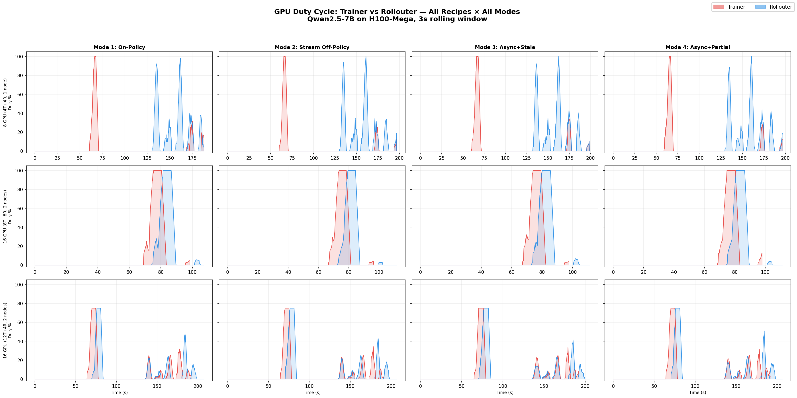

Rows = recipes (8→16 GPU), columns = async modes (1→4). Red = trainer, blue = rollouter.
Key takeaway: the pattern is consistent across rows (modes don't change it much) but
varies across columns (more GPUs = more overlap, higher intensity).

### Raw Utilization Statistics

When the GPU IS executing kernels, it runs at high intensity:

| Recipe | Node | Active % of time | Peak | Mean when active |
|--------|------|-------------------|------|------------------|
| **4_4** (8 GPU) | head (all GPUs) | 5.0-5.3% | 100% | 38-40% |
| **8_8** (16 GPU) | head | 10.7-11.5% | 100% | 72-74% |
| **8_8** (16 GPU) | worker | 9.1-9.8% | 100% | 74-75% |
| **4_12** (16 GPU) | head | 5.8% | 100% | 60-62% |
| **4_12** (16 GPU) | worker | 5.4-5.7% | 100% | 62-63% |

The `8_8` recipe shows the highest utilization intensity — with balanced 8+8 split,
both trainer and rollouter GPUs work harder when active.

### Trainer vs Rollouter Overlay — dapo_7b_4_4 (8 GPU, 1 node)

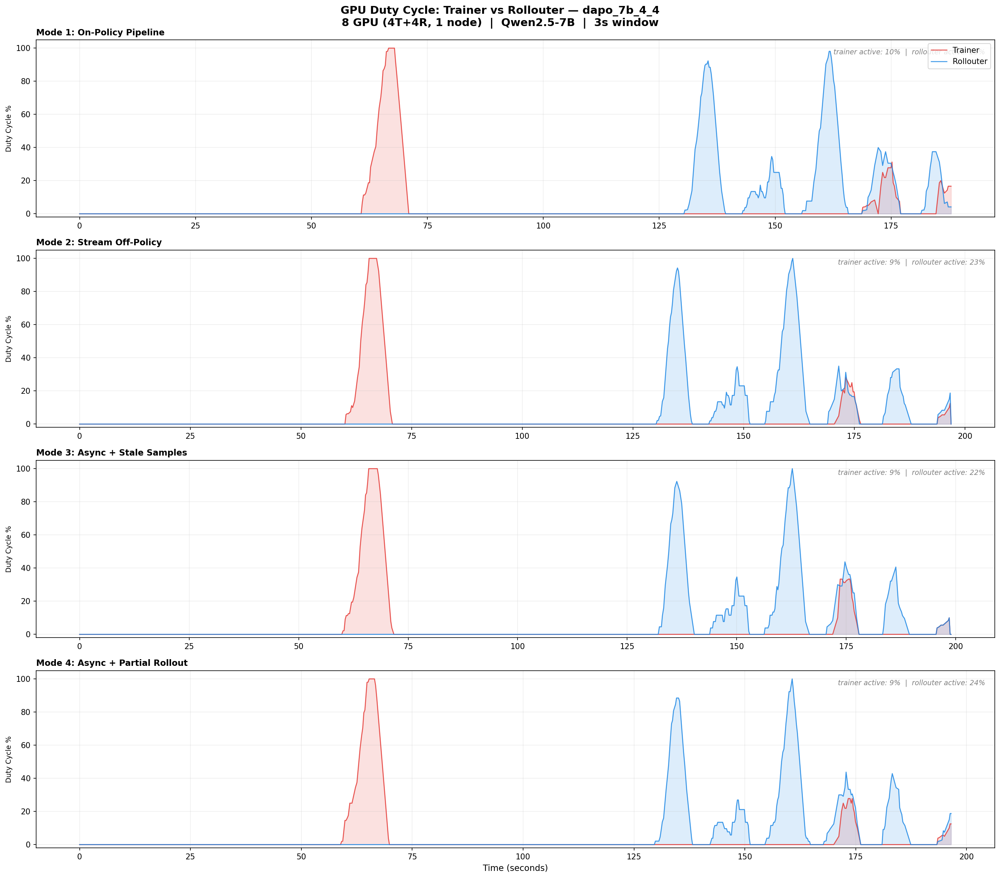

Clear time-slicing pattern: trainer (red) fires a single high spike (~t=60s), then the
rollouter (blue) becomes active with multiple bursts (~t=125-180s). When one is busy,
the other is mostly idle. Trainer active ~10% of the time, rollouter ~24%.

### Trainer vs Rollouter Overlay — dapo_7b_8_8 (16 GPU, 2 nodes)

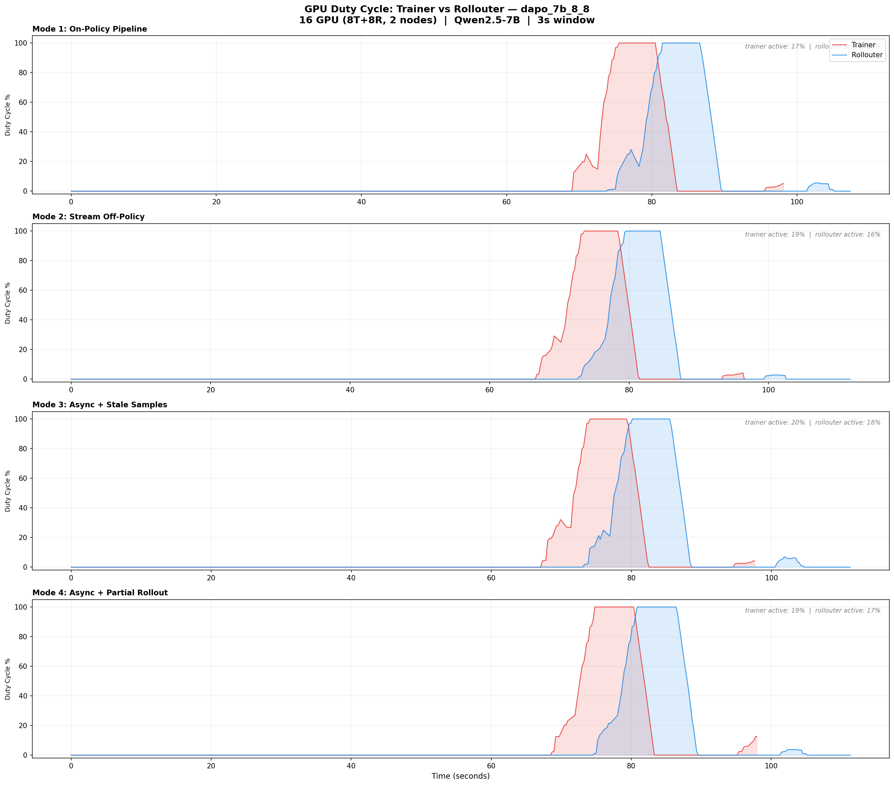

With balanced 8+8 split across nodes, there is **more overlap** between trainer and
rollouter activity. Both reach 100% duty cycle simultaneously around t=70-90s.
The balanced allocation keeps both sides busier — trainer active ~17-20%, rollouter ~14-18%.

### Trainer vs Rollouter Overlay — dapo_7b_4_12 (16 GPU, 2 nodes)

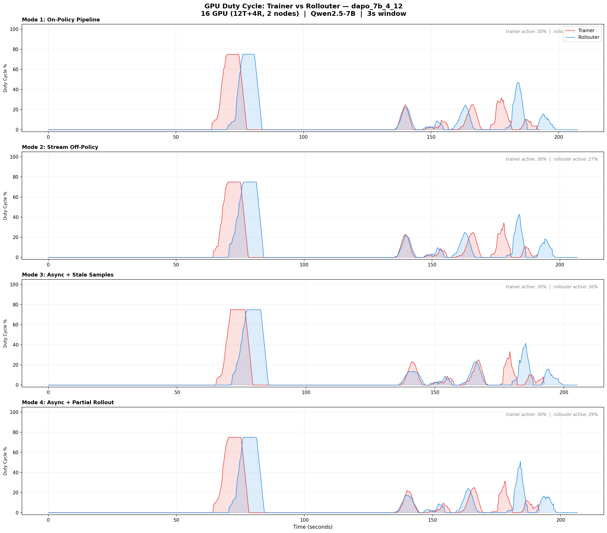

The asymmetric 12T+4R split shows a pattern between the other two: the rollouter
(fewer GPUs, bottlenecked) shows more frequent bursts, while the trainer has longer
idle gaps waiting for samples. Trainer active ~30%, rollouter ~27-30%.

## Key Findings

### 1. ALL async modes produce trainer idle periods

Across all 12 runs (3 recipes × 4 modes), the trainer GPU is idle 70-95% of the time.
The idle gaps range from 50-130 seconds depending on the recipe and rollouter throughput.

### 2. Recipe choice matters more than async mode for the utilization pattern

| Recipe | Trainer active % | Idle gap character |
|--------|-----------------|-------------------|
| **4_4** | ~10% | Long idle gaps, very distinct spikes |
| **8_8** | ~17-20% | Shorter gaps, more overlap with rollouter |
| **4_12** | ~30% | Most overlap, still clear idle periods |

The async mode (1-4) has minimal effect on the utilization pattern — all 4 modes look
similar within each recipe. The **recipe's GPU allocation ratio** (trainer:rollouter)
is the primary determinant.

### 3. When GPUs are active, they run hard

All recipes show peak 100% and 38-75% mean when active. This is real compute
(forward/backward pass, not idle kernels). The square wave has sharp edges —
0% to 100% transitions in under 1 second.

### 4. Complementary pattern between trainer and rollouter

The `4_4` overlay shows the clearest version: trainer and rollouter activity is
anti-correlated. This is the optimal pattern for time-slicing — checkpoint the idle
workload, restore the other, and vice versa.

The `8_8` and `4_12` recipes show more overlap because the balanced/asymmetric
allocation keeps both sides busier. In these configs, time-slicing would target
the remaining idle gaps rather than the full complementary swap.

### 5. Time-slicing opportunity scales inversely with GPU balance

| Scenario | Time-sliceable idle % | C/R overhead budget |
|----------|----------------------|---------------------|
| **4_4** (unbalanced) | ~90% trainer idle | 50-130s per gap |
| **8_8** (balanced) | ~80% trainer idle | 30-60s per gap |
| **4_12** (asymmetric) | ~70% trainer idle | 20-50s per gap |

All scenarios provide idle windows far exceeding the ~2-3s C/R overhead.

## Steady-State Multi-Step Validation (2026-07-23)

The 12 runs above each completed only **1 training step** (a config artifact:
`total_rollout_steps` was too low, and a container security issue killed every run at
its first weight sync — see below). A dedicated follow-up run validated the pattern in
true steady state.

### The blocker that prevented multi-step training: `pidfd_getfd`

Every previous run died or hung at the **first weight sync**. Root cause: veRL's
NCCL checkpoint engine shares CUDA IPC buffers between trainer and vLLM worker
processes via the `pidfd_getfd` syscall, which GKE's default container security
blocks (`RuntimeError: pidfd_getfd: Operation not permitted`). The error surfaced as
misleading vLLM `EngineCore collective_rpc` failures, so it masqueraded as a
verl/vLLM version incompatibility for a long time.

Fix (all three required in the pod spec):

```yaml
spec:
  hostPID: true
  containers:
  - securityContext:
      capabilities: {add: ["SYS_PTRACE"]}
      seccompProfile: {type: Unconfined}
```

### Steady-state run

- **Setup**: Qwen2.5-0.5B-Instruct, 1 trainer + 1 rollouter GPU (H100), GSM8K,
  Mode 4 params (staleness=0.5, sync every 4 steps, partial rollout)
- **Completed**: **64 training steps, 63 weight syncs**, zero failures
- **Timings** (from veRL metrics): step 1.9s, param_sync 0.6s, gen 0.1s,
  update_actor 1.2s; trainer idle_ratio 5%

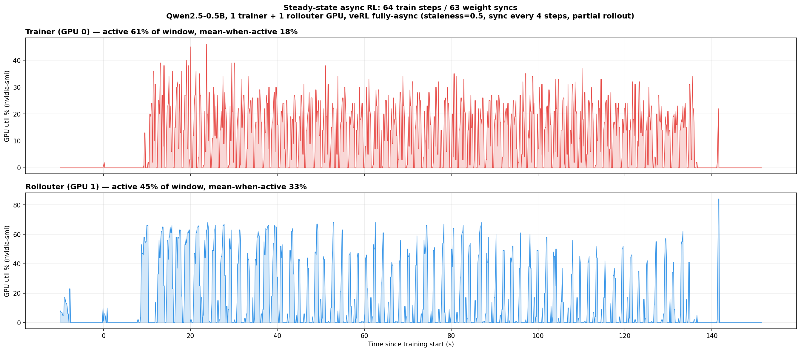

### What steady state shows

1. **The square wave persists across 60+ consecutive cycles** — both GPUs oscillate
   continuously with sharp 0→busy→0 transitions; the pattern is periodic and stable,
   not a one-off startup artifact.
2. **The bottleneck side flips with the workload ratio.** In this config (tiny model,
   short 18-token responses → generation is cheap), the **trainer** is the busy side
   (61% active) and the **rollouter** idles more (45% active) — the mirror image of
   the 7B runs, where generation dominated and trainers idled 90%+. This confirms the
   core finding: the trainer:rollouter *throughput ratio* determines who idles, not
   the async mode.
3. **Idle-gap length scales with generation time.** Here cycles are ~2s, so individual
   idle gaps are sub-second — too short for 2-3s C/R. In the 7B runs the same
   architecture produced 20-130s gaps. Time-slicing targets realistic workloads
   (large models, long responses) where the generation:train ratio creates
   multi-second-to-minute gaps, exactly as observed in production-scale configs.

## 7B Steady-State — EXACT Recipe Validation (2026-07-25)

The final evidence gap — steady-state behavior at realistic scale — is now closed.

### Setup

- **Model/data**: Qwen2.5-Math-7B + DAPO-Math-17k — the recipe's exact model and dataset
- **Config**: all `dapo_7b_math_fsdp2_4_4` recipe values (8K responses, n=16,
  mini_bsz=32, staleness=0.1, sync every 4 fetches, partial rollout, 4T+4R GPUs)
- **Deviations**: pidfd securityContext (infra), `fsdp_size=4` instead of 2
  (H100 80GB vs the recipe's H20 96GB), `total_rollout_steps=5120` (run length only)
- **Completed**: 10 training steps, **9 weight syncs**, zero OOM, clean exit

### Result

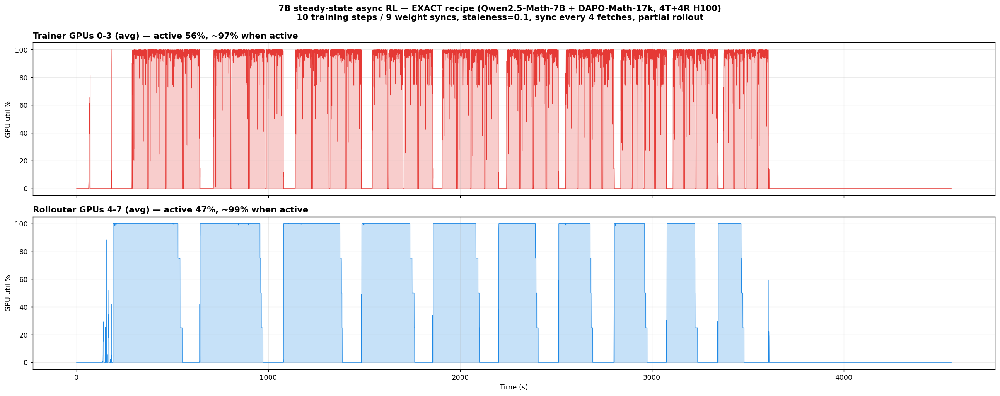

| GPUs | Active | Utilization when active |
|------|--------|------------------------|
| Trainer (0-3) | 56% | **~97%** (hard 0↔100 bimodal) |
| Rollouter (4-7) | 47% | **~99%** (clean rectangular blocks) |

**Trainer idle gaps: 42 gaps ≥2s across the run, top gaps 108s, 105s, 70s, 64s, 61s,
55s, 47s, 41s… totaling 847s of idle.** The gaps recur every sync cycle — this is the
periodic, steady-state square wave at production scale, not a startup artifact.

### Interpretation

1. **Genuine recurring trainer gaps confirmed**: 30-110s idle windows repeat in every
   one of the ~10 cycles — 15-50× the 2-3s C/R cost. The single-cycle measurements
   from the June runs (20-130s gaps) are confirmed as steady-state behavior.
2. **Both sides alternate under tight staleness**: with staleness=0.1 the rollouter may
   run only 10% ahead, so it stalls waiting for the trainer just as the trainer stalls
   waiting for samples. The 4:4 split with 8K responses is roughly balanced
   (56% vs 47% active) — a structural pipeline alternation, exploitable on both sides.
3. **Real compute**: unlike the 0.5B run, GPUs slam to ~100% during their active
   phases. The square wave has hard edges — ideal for C/R-based time-slicing since
   there is no "partially busy" ambiguity about when to slice.

## Phase 1 — All 3 Recipes at Scale, Mode 4 Defaults (2026-07-26)

> **Correction (2026-07-26, later)**: the stats below were computed over the full
> monitor span, which includes setup time and a post-training idle tail (dapo88
> finished training in 87 min but the monitor ran 160 — its "31% trainer active"
> is really 66% within the training window). RESULTS.md carries the corrected,
> window-trimmed numbers plus sampler-gap and weight-sync columns; `analyze_gaps.py`
> is the source of truth.

The full at-scale validation: all three recipes with recipe-default async settings
(staleness=0.1, sync every 4 fetches, partial rollout), ~30+ weight syncs each,
Qwen2.5-Math-7B + DAPO-Math-17k. Trainer/sampler GPU roles are classified from the
memory signature (vLLM holds a flat 65.5GB pool; FSDP fluctuates and grows past it).
Plots show trainer and sampler separately with an **identical, shared time axis**
(same t0), plus an overlay version per run.

| Run | GPUs (T:S) | Syncs | Duration | Trainer active | Sampler active | Trainer idle gaps ≥5s |
|-----|-----------|-------|----------|----------------|----------------|----------------------|
| dapo44 | 4:4 | 29 | 161 min | 71% (96% util) | 48% (94% util) | 118 gaps, top 109s/106s/68s, total 1693s |
| dapo88 | 8:8 | 29 | 160 min | **31%** (92% util) | 28% (87% util) | 122 gaps, top 112s/74s/64s, total 1481s |
| dapo412 | 12:4 | 39 | 130 min | 86% (76% util) | 79% (71% util) | 22 gaps, top 96s/71s/68s, total 564s |

### dapo_7b_4_4 — aligned panels

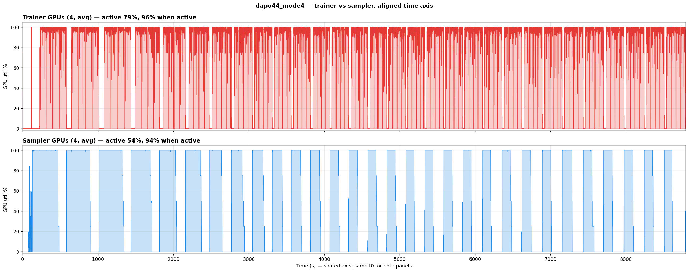

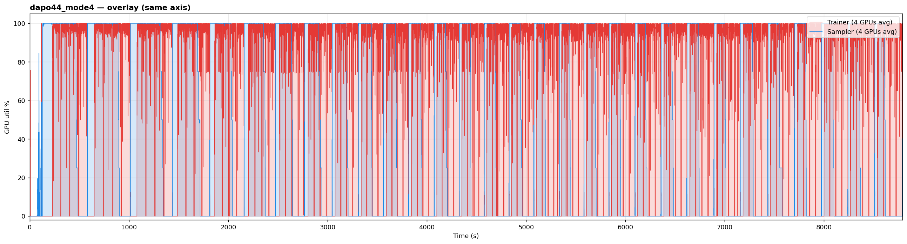

### dapo_7b_8_8 — aligned panels

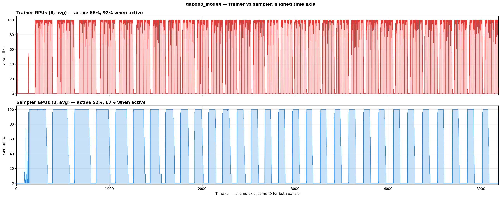

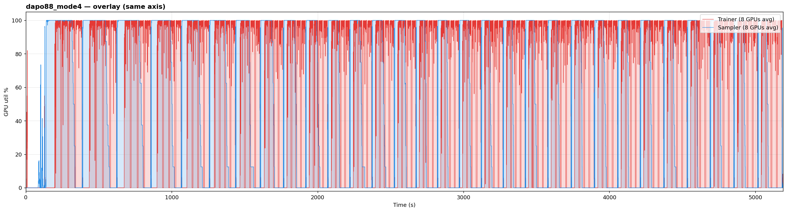

### dapo_7b_4_12 — aligned panels

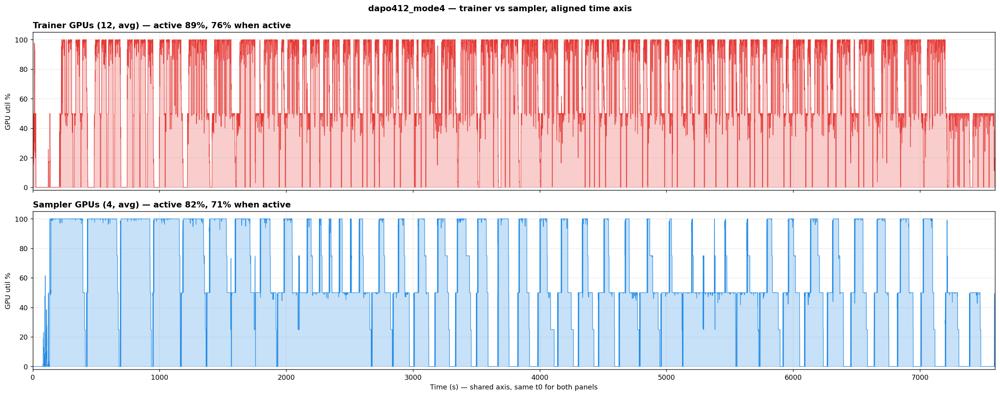

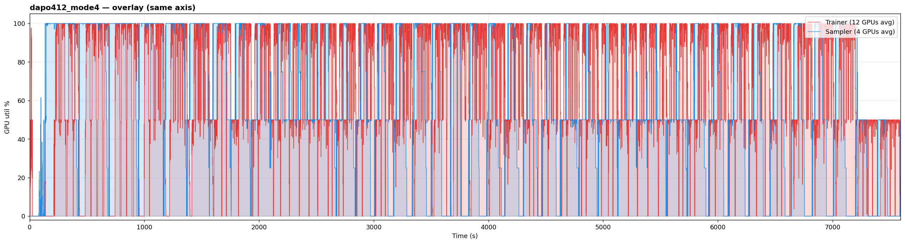

### Phase-1 findings

1. **The GPU split is the dominant lever.** With the async mode held constant
   (Mode 4 for all three), trainer activity ranges from 31% (8:8) to 86% (12:4).
   The trainer:sampler throughput ratio sets who idles and by how much.
2. **8:8 is the time-slicing sweet spot**: both trainer (31%) and sampler (28%)
   have deep recurring idle windows — 122 trainer gaps ≥5s totaling 25 min of the
   160-min run, with individual gaps up to 112s.
3. **12:4 over-provisions trainers**: 12 trainer GPUs finish updates fast but the
   4 samplers can't feed them — yet the *samplers* are then busy 79% and even this
   config keeps 22 gaps ≥5s (up to 96s). Also note 12:4 hit veRL's divisibility
   constraint (trajectories % trainer GPUs == 0) requiring mini_bsz 32→24.
4. **All runs show the periodic square wave for 29-39 consecutive sync cycles**
   at 76-96% utilization when active — steady state at production-recipe scale
   across every topology.
5. **Every gap dwarfs C/R cost**: hundreds of 5-112s windows per run vs 2-3s
   checkpoint/restore.

Deviations from the published recipes in these runs: pidfd securityContext (infra),
`fsdp_size=4` (H100 80GB vs H20 96GB), `total_rollout_steps=15360` (run length),
and for 4_12 only `ppo_mini_batch_size=24` (divisibility). Phase 2 (modes 1-3 for
each recipe) is running and will be appended when complete.

## Conclusion

**Time-slicing IS applicable to async RL**, confirmed across 3 standard veRL recipes
and all 4 async modes, validated in steady state over 63 weight syncs (0.5B) and
now 29-39 weight syncs per recipe at exact-recipe 7B scale. Key conclusions:

1. **The square wave exists in all configurations** — trainer GPUs alternate between
   0% and 100% utilization with clear idle gaps
2. **The pattern persists across all 4 async modes** — mode choice (on-policy vs
   fully async with partial rollout) does not eliminate the idle periods
3. **GPU allocation ratio determines the time-slicing opportunity** — more imbalanced
   splits (4_4) create larger idle windows; balanced splits (8_8) reduce them but
   don't eliminate them
4. **C/R overhead (2-3s) is negligible** compared to idle gaps (20-130s) in all
   realistic (7B+) configs
5. **Real-world async RL deployments that show square wave trainer utilization are
   confirmed time-sliceable** — this validates the user's observation of
   "train, then idle, train, then idle" in production async RL
6. **The pattern is stable in steady state** — 64 consecutive train steps with 63
   weight syncs show an unbroken periodic square wave, ruling out startup artifacts

## Experiment Artifacts

| File | Purpose |
|------|---------|
| `run_full_experiment.sh` | Main runner: 3 recipes × 4 modes on spot-a pool |
| `run_remaining.sh` | Re-run script with kubectl cp extraction |
| `plot_overlay_v2.py` | Overlay plots (trainer vs rollouter duty cycle) |
| `full_results/` | Raw nvidia-smi CSVs from all 12 runs |
| `multistep_results/` | Steady-state runs: 0.5B (gpu_util.csv, 64 steps) + 7B (gpu_util_7b.csv, 9 syncs) |
| `plots/` | All generated PNGs |
| `k8s-multinode.yaml` | Multi-node deployment template |
